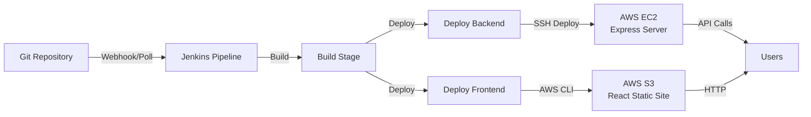

# Complete Deployment Guide: Jenkins Pipeline with React + Express

## 📋 Table of Contents

1. [Overview](#overview)
2. [Prerequisites](#prerequisites)
3. [AWS Setup](#aws-setup)
   - [EC2 Instance Setup](#ec2-instance-setup)
   - [S3 Bucket Setup](#s3-bucket-setup)
   - [IAM User & Permissions](#iam-user--permissions)
4. [Jenkins Setup](#jenkins-setup)
5. [Pipeline Configuration](#pipeline-configuration)
6. [Deployment Process](#deployment-process)
7. [Troubleshooting](#troubleshooting)
8. [Monitoring & Maintenance](#monitoring--maintenance)

---

## Overview

This guide walks you through deploying a **React + Express** application using **Jenkins Pipeline** with:
- **Backend (Express)**: Hosted on AWS EC2 with PM2 process management
- **Frontend (React)**: Hosted on AWS S3 as a static website
- **CI/CD**: Automated deployment via Jenkins pipeline

> **Note**: For detailed Jenkins installation and setup instructions, see [JENKINS_SETUP.md](JENKINS_SETUP.md)

### Architecture Diagram



---

## Prerequisites

Before starting, ensure you have:

- ✅ **AWS Account** with billing enabled
- ✅ **Git Repository** (GitHub, GitLab, or Bitbucket)
- ✅ **Jenkins Server** (local or remote - see [JENKINS_SETUP.md](JENKINS_SETUP.md))
- ✅ **Domain Name** (optional, for custom domain)
- ✅ **Local Development Environment**:
  - Node.js 18+
  - Git
  - AWS CLI installed locally
  - SSH client

---

## AWS Setup

### EC2 Instance Setup

#### Step 1: Launch EC2 Instance

1. **Login to AWS Console** → Navigate to EC2 Dashboard

2. **Launch Instance**:
   - Click **"Launch Instance"**
   - **Name**: `interior-portfolio-backend`
   - **AMI**: Ubuntu Server 22.04 LTS (Free tier eligible)
   - **Instance Type**: `t2.micro` (or `t3.micro` for better performance)
   - **Key Pair**: Create new key pair
     - Name: `portfolio-ec2-key`
     - Type: RSA
     - Format: `.pem`
     - **Download and save securely** (you'll need this!)

3. **Configure Security Group**:
   - Create new security group: `portfolio-backend-sg`
   - Add the following inbound rules:

   | Type | Protocol | Port Range | Source | Description |
   |------|----------|------------|--------|-------------|
   | SSH | TCP | 22 | My IP | SSH access |
   | HTTP | TCP | 80 | 0.0.0.0/0 | HTTP access |
   | HTTPS | TCP | 443 | 0.0.0.0/0 | HTTPS access |
   | Custom TCP | TCP | 5000 | 0.0.0.0/0 | Express API |

4. **Storage**: 8 GB gp3 (default is fine)

5. **Launch Instance** and wait for it to be in "Running" state

#### Step 2: Connect to EC2 Instance

```bash
# Set correct permissions for your key
chmod 400 portfolio-ec2-key.pem

# Connect via SSH (replace with your instance IP)
ssh -i portfolio-ec2-key.pem ubuntu@<YOUR_EC2_PUBLIC_IP>
```

#### Step 3: Install Required Software on EC2

Once connected to your EC2 instance, run:

```bash
# Update system packages
sudo apt update && sudo apt upgrade -y

# Install Node.js 18.x
curl -fsSL https://deb.nodesource.com/setup_18.x | sudo -E bash -
sudo apt-get install -y nodejs

# Verify installation
node --version  # Should show v18.x.x
npm --version

# Install PM2 globally (process manager)
sudo npm install -g pm2

# Install Git
sudo apt install -y git

# Create application directory
mkdir -p /home/ubuntu/interior-designer-portfolio
```

#### Step 4: Configure Git Access on EC2

You need to allow your EC2 instance to pull code from your Git repository:

```bash
# Generate SSH key on EC2
ssh-keygen -t ed25519 -C "ec2-deploy" -f ~/.ssh/git_deploy_key -N ""

# Display the public key
cat ~/.ssh/git_deploy_key.pub
```

**Copy this public key**, then add it to your Git repository:

**For GitHub:**
1. Go to your repository → **Settings** → **Deploy keys** → **Add deploy key**
2. Paste the public key
3. Title: `EC2 Deploy Key`
4. Click **"Add key"**

**For GitLab:**
1. Go to your project → **Settings** → **Repository** → **Deploy Keys**
2. Click **"Add new key"**
3. Paste the public key
4. Title: `EC2 Deploy Key`
5. Click **"Add key"**

**For Bitbucket:**
1. Go to repository → **Settings** → **Access keys** → **Add key**
2. Paste the public key
3. Label: `EC2 Deploy Key`
4. Click **"Add key"**

Configure SSH on EC2:

```bash
# Add your Git provider to known hosts
# For GitHub:
ssh-keyscan github.com >> ~/.ssh/known_hosts

# For GitLab:
ssh-keyscan gitlab.com >> ~/.ssh/known_hosts

# For Bitbucket:
ssh-keyscan bitbucket.org >> ~/.ssh/known_hosts

# Configure SSH to use the deploy key
cat >> ~/.ssh/config << EOF
Host github.com gitlab.com bitbucket.org
  User git
  IdentityFile ~/.ssh/git_deploy_key
  StrictHostKeyChecking no
EOF

chmod 600 ~/.ssh/config
```

#### Step 5: Initial Deployment on EC2

```bash
# Clone your repository (replace with your repo URL)
cd /home/ubuntu

# For GitHub:
git clone git@github.com:YOUR_USERNAME/YOUR_REPO.git interior-designer-portfolio

# For GitLab:
git clone git@gitlab.com:YOUR_USERNAME/YOUR_REPO.git interior-designer-portfolio

# For Bitbucket:
git clone git@bitbucket.org:YOUR_USERNAME/YOUR_REPO.git interior-designer-portfolio

cd interior-designer-portfolio

# Install production dependencies
npm install --production

# Create logs directory
mkdir -p logs

# Start application with PM2
pm2 start ecosystem.config.js

# Save PM2 process list
pm2 save

# Setup PM2 to start on system boot
pm2 startup
# Copy and run the command that PM2 outputs
```

#### Step 6: Verify Backend is Running

```bash
# Check PM2 status
pm2 status

# Check logs
pm2 logs interior-designer-portfolio

# Test the API locally
curl http://localhost:5000/api/projects
```

From your local machine, test the public endpoint:

```bash
curl http://<YOUR_EC2_PUBLIC_IP>:5000/api/projects
```

---

### S3 Bucket Setup 

#### Step 1: Create S3 Bucket

```bash
# Set your desired bucket name (must be globally unique)
export BUCKET_NAME="interior-portfolio-frontend"
export AWS_REGION="us-east-1"

# Create bucket
aws s3 mb s3://$BUCKET_NAME --region $AWS_REGION
```

Or via AWS Console:
1. Go to **S3** → **Create bucket**
2. **Bucket name**: `interior-portfolio-frontend` (must be globally unique)
3. **Region**: Choose your preferred region (e.g., `us-east-1`)
4. **Uncheck** "Block all public access" (we need public access for website hosting)
5. Acknowledge the warning
6. Click **"Create bucket"**

#### Step 2: Enable Static Website Hosting

```bash
# Enable static website hosting
aws s3 website s3://$BUCKET_NAME \
  --index-document index.html \
  --error-document index.html
```

Or via Console:
1. Select your bucket → **Properties** tab
2. Scroll to **"Static website hosting"** → Click **"Edit"**
3. **Enable** static website hosting
4. **Index document**: `index.html`
5. **Error document**: `index.html` (for React Router support)
6. Click **"Save changes"**
7. **Note the website endpoint URL** (e.g., `http://bucket-name.s3-website-us-east-1.amazonaws.com`)

#### Step 3: Configure Bucket Policy for Public Access

Create a file `bucket-policy.json`:

```json
{
  "Version": "2012-10-17",
  "Statement": [
    {
      "Sid": "PublicReadGetObject",
      "Effect": "Allow",
      "Principal": "*",
      "Action": "s3:GetObject",
      "Resource": "arn:aws:s3:::interior-portfolio-frontend/*"
    }
  ]
}
```

> **Replace** `interior-portfolio-frontend` with your actual bucket name

Apply the policy:

```bash
# Apply bucket policy
aws s3api put-bucket-policy \
  --bucket $BUCKET_NAME \
  --policy file://bucket-policy.json
```

Or via Console:
1. Select your bucket → **Permissions** tab
2. Scroll to **"Bucket policy"** → Click **"Edit"**
3. Paste the JSON policy above (replace bucket name)
4. Click **"Save changes"**

#### Step 4: Configure CORS (if needed)

If your frontend needs to make API calls from the S3 domain:

```bash
# Create cors.json
cat > cors.json << EOF
{
  "CORSRules": [
    {
      "AllowedOrigins": ["*"],
      "AllowedMethods": ["GET", "HEAD"],
      "AllowedHeaders": ["*"],
      "MaxAgeSeconds": 3000
    }
  ]
}
EOF

# Apply CORS configuration
aws s3api put-bucket-cors \
  --bucket $BUCKET_NAME \
  --cors-configuration file://cors.json
```

---

### IAM User & Permissions

#### Step 1: Create IAM User for Jenkins

1. Go to **IAM** → **Users** → **Create user**
2. **User name**: `jenkins-deployer`
3. **Access type**: Select **"Access key - Programmatic access"**
4. Click **"Next"**

#### Step 2: Attach Permissions

Click **"Attach policies directly"** and create a custom policy:

1. Click **"Create policy"** → **JSON** tab
2. Paste the following policy:

```json
{
  "Version": "2012-10-17",
  "Statement": [
    {
      "Sid": "S3DeploymentAccess",
      "Effect": "Allow",
      "Action": [
        "s3:PutObject",
        "s3:PutObjectAcl",
        "s3:GetObject",
        "s3:DeleteObject",
        "s3:ListBucket",
        "s3:PutBucketWebsite",
        "s3:GetBucketWebsite"
      ],
      "Resource": [
        "arn:aws:s3:::interior-portfolio-frontend",
        "arn:aws:s3:::interior-portfolio-frontend/*"
      ]
    }
  ]
}
```

3. Click **"Next"**
4. **Policy name**: `JenkinsDeploymentPolicy`
5. Click **"Create policy"**

Go back to user creation and attach this policy.

#### Step 3: Get Access Keys

1. After creating the user, you'll see **Access key ID** and **Secret access key**
2. **Download the CSV** or copy these values securely
3. **Important**: You won't be able to see the secret key again!

---

## Jenkins Setup

> **For complete Jenkins installation and configuration instructions, see [JENKINS_SETUP.md](JENKINS_SETUP.md)**

This section provides a quick overview of the Jenkins requirements.

### Required Jenkins Credentials

You need to configure the following credentials in Jenkins:

**Navigate to**: Jenkins Dashboard → Manage Jenkins → Manage Credentials → (global) → Add Credentials

#### AWS Credentials

| Credential ID | Type | Value |
|---------------|------|-------|
| `aws-access-key-id` | Secret text | Your AWS access key ID |
| `aws-secret-access-key` | Secret text | Your AWS secret access key |
| `aws-region` | Secret text | AWS region (e.g., us-east-1) |
| `s3-bucket-name` | Secret text | S3 bucket name |

#### EC2 Credentials

| Credential ID | Type | Value |
|---------------|------|-------|
| `ec2-host` | Secret text | EC2 public IP address |
| `ec2-user` | Secret text | EC2 username (ubuntu) |
| `ec2-ssh-key` | SSH Username with private key | Your .pem file contents |

### Update Backend API URL in Frontend

Before deploying, update your React app to point to the EC2 backend:

1. Create/edit `client/.env.production`:

```env
VITE_API_URL=http://<YOUR_EC2_PUBLIC_IP>:5000
```

2. Update your React API calls to use this environment variable:

```javascript
// In your React components
const API_URL = import.meta.env.VITE_API_URL || 'http://localhost:5000';

// Example API call
fetch(`${API_URL}/api/projects`)
  .then(res => res.json())
  .then(data => console.log(data));
```

---

## Pipeline Configuration

### Pipeline Overview

The Jenkins pipeline is defined in the `Jenkinsfile` at the root of your project. It consists of three main stages:

1. **Build Stage**: Installs dependencies and builds React app
2. **Deploy Backend**: SSHs into EC2 and runs deployment script
3. **Deploy Frontend**: Syncs React build to S3 bucket

### Setting Up the Pipeline Job

1. **Create New Pipeline**:
   - Jenkins Dashboard → **New Item**
   - Name: `Interior-Portfolio-Deployment`
   - Type: **Pipeline**
   - Click **OK**

2. **Configure Pipeline**:
   - **Description**: `Automated deployment for React + Express portfolio`
   - **Build Triggers**: 
     - Check **"Poll SCM"** with schedule `H/5 * * * *` (checks every 5 minutes)
     - Or configure webhooks (see [JENKINS_SETUP.md](JENKINS_SETUP.md))
   - **Pipeline**:
     - **Definition**: Pipeline script from SCM
     - **SCM**: Git
     - **Repository URL**: Your Git repository URL
     - **Credentials**: Add if repository is private
     - **Branch Specifier**: `*/main`
     - **Script Path**: `Jenkinsfile`
   - Click **Save**

3. **Test the Pipeline**:
   - Click **"Build Now"**
   - Watch the build progress
   - Check **Console Output** for logs

---

## Deployment Process

### Automated Deployment Workflow

1. **Make Changes to Your Code**:
   ```bash
   # Make your changes
   git add .
   git commit -m "Your commit message"
   git push origin main
   ```

2. **Jenkins Automatically Detects Changes**:
   - If using Poll SCM, Jenkins checks for changes every 5 minutes
   - If using webhooks, Jenkins is triggered immediately

3. **Pipeline Executes**:
   - **Build Stage**: Installs dependencies, builds React app
   - **Deploy Backend**: SSHs to EC2, pulls latest code, restarts PM2
   - **Deploy Frontend**: Syncs React build to S3

4. **Access Your Application**:
   - **Frontend**: `http://<BUCKET_NAME>.s3-website-<REGION>.amazonaws.com`
   - **Backend API**: `http://<EC2_IP>:5000/api/projects`

### Manual Deployment

If you need to deploy manually:

#### Backend Manual Deployment

```bash
# SSH into EC2
ssh -i portfolio-ec2-key.pem ubuntu@<EC2_IP>

# Navigate to project directory
cd /home/ubuntu/interior-designer-portfolio

# Pull latest code
git pull origin main

# Install dependencies
npm install --production

# Restart application
pm2 restart ecosystem.config.js
```

#### Frontend Manual Deployment

```bash
# Build React app locally
cd client
npm run build

# Deploy to S3
aws s3 sync build/ s3://<BUCKET_NAME> --delete

# Set cache headers for static assets
aws s3 cp s3://<BUCKET_NAME> s3://<BUCKET_NAME> \
  --recursive \
  --metadata-directive REPLACE \
  --cache-control max-age=31536000,public \
  --exclude "*.html"

# Set cache headers for HTML files
aws s3 cp s3://<BUCKET_NAME> s3://<BUCKET_NAME> \
  --recursive \
  --metadata-directive REPLACE \
  --cache-control no-cache \
  --include "*.html"
```

---

## Troubleshooting

### Common Issues & Solutions

#### 1. **Pipeline Fails at Build Stage**

**Error**: `npm install` fails

**Solution**:
```bash
# Check package.json dependencies
# Ensure all dependencies are properly listed
# Try locally first:
npm install
cd client && npm install
```

#### 2. **SSH Connection Failed to EC2**

**Error**: `Permission denied (publickey)`

**Solution**:
- Verify `ec2-ssh-key` credential contains the complete private key
- Check EC2 security group allows SSH (port 22)
- Ensure the key format is correct (no extra spaces/newlines)

```bash
# Test SSH connection locally
ssh -i portfolio-ec2-key.pem ubuntu@<EC2_IP>
```

#### 3. **S3 Deployment Fails**

**Error**: `Access Denied` or `Bucket not found`

**Solution**:
- Verify IAM user has correct permissions
- Check `s3-bucket-name` credential matches actual bucket name
- Ensure bucket exists in the specified region

```bash
# Test AWS credentials locally
aws s3 ls s3://<BUCKET_NAME>
```

#### 4. **Backend Not Responding**

**Error**: API calls return 502/504 errors

**Solution**:
```bash
# SSH into EC2
ssh -i portfolio-ec2-key.pem ubuntu@<EC2_IP>

# Check PM2 status
pm2 status

# View logs
pm2 logs interior-designer-portfolio

# Restart if needed
pm2 restart interior-designer-portfolio
```

#### 5. **CORS Errors in Browser**

**Error**: `Access to fetch blocked by CORS policy`

**Solution**:
- Ensure Express server has CORS enabled (already configured in `server.js`)
- Verify the frontend is making requests to the correct backend URL
- Check browser console for exact error message

#### 6. **React Router 404 on Refresh**

**Error**: S3 returns 404 when refreshing on routes like `/projects`

**Solution**: Already configured! The S3 bucket is set to use `index.html` as the error document, which handles React Router correctly.

#### 7. **Jenkins Build Fails: "node: command not found"**

**Error**: Node.js not found during build

**Solution**:
- Verify NodeJS plugin is installed in Jenkins
- Configure NodeJS in Jenkins: Manage Jenkins → Global Tool Configuration → NodeJS
- Add NodeJS installation with name `18`

#### 8. **Deployment Script Fails on EC2**

**Error**: Script execution fails on EC2

**Solution**:
```bash
# SSH into EC2
ssh -i portfolio-ec2-key.pem ubuntu@<EC2_IP>

# Check if Git repository is accessible
cd /home/ubuntu/interior-designer-portfolio
git pull origin main

# Check if PM2 is running
pm2 status

# Check deployment script permissions
chmod +x scripts/deploy-backend.sh
```

---

## Monitoring & Maintenance

### EC2 Monitoring

#### Check Application Status

```bash
# SSH into EC2
ssh -i portfolio-ec2-key.pem ubuntu@<EC2_IP>

# Check PM2 status
pm2 status

# View real-time logs
pm2 logs interior-designer-portfolio --lines 100

# Monitor system resources
pm2 monit
```

#### View Application Logs

```bash
# On EC2 instance
cd /home/ubuntu/interior-designer-portfolio

# View error logs
tail -f logs/err.log

# View output logs
tail -f logs/out.log

# View combined logs
tail -f logs/combined.log
```

#### Restart Application

```bash
# Restart the application
pm2 restart interior-designer-portfolio

# Reload with zero-downtime
pm2 reload interior-designer-portfolio

# Stop the application
pm2 stop interior-designer-portfolio

# Start the application
pm2 start ecosystem.config.js
```

### S3 Monitoring

#### Check S3 Bucket Contents

```bash
# List all files in bucket
aws s3 ls s3://<BUCKET_NAME> --recursive

# Check bucket size
aws s3 ls s3://<BUCKET_NAME> --recursive --summarize --human-readable
```

### Jenkins Monitoring

#### View Build History

1. Go to your pipeline job
2. Click on **"Build History"**
3. Click on any build number to see details
4. Click **"Console Output"** to see logs

#### Set Up Email Notifications

1. Go to: Manage Jenkins → Configure System → E-mail Notification
2. Configure SMTP server settings
3. In your pipeline job configuration, add post-build action for email notifications

### Cost Monitoring

#### Estimated Monthly Costs (Free Tier)

- **EC2 t2.micro**: $0 (first 12 months) / ~$8.50/month after
- **S3 Storage**: $0.023 per GB (~$0.50 for 20GB)
- **S3 Requests**: $0.0004 per 1,000 GET requests
- **Data Transfer**: First 1GB free, then $0.09/GB

**Total**: ~$0-2/month (free tier) or ~$10-15/month (after free tier)

#### Set Up Billing Alerts

1. Go to **AWS Billing Dashboard** → **Budgets**
2. Click **"Create budget"**
3. Select **"Cost budget"**
4. Set amount: `$10` (or your threshold)
5. Configure email alerts

---

## Advanced Configuration

### Setting Up a Custom Domain

#### For S3 Frontend

1. **Register domain** (e.g., via Route 53, Namecheap, etc.)

2. **Create CloudFront distribution**:
   - Origin: Your S3 bucket website endpoint
   - Alternate domain names (CNAMEs): `www.yourdomain.com`
   - SSL certificate: Request via AWS Certificate Manager

3. **Update DNS records**:
   - Add CNAME record: `www` → CloudFront distribution domain

#### For EC2 Backend

1. **Allocate Elastic IP**:
   ```bash
   # Allocate Elastic IP
   aws ec2 allocate-address --domain vpc
   
   # Associate with EC2 instance
   aws ec2 associate-address --instance-id <INSTANCE_ID> --allocation-id <ALLOCATION_ID>
   ```

2. **Update DNS**:
   - Add A record: `api.yourdomain.com` → Elastic IP

3. **Setup Nginx reverse proxy** (optional but recommended):
   ```bash
   sudo apt install nginx
   
   # Configure Nginx to proxy to Express
   sudo nano /etc/nginx/sites-available/default
   ```

   ```nginx
   server {
       listen 80;
       server_name api.yourdomain.com;

       location / {
           proxy_pass http://localhost:5000;
           proxy_http_version 1.1;
           proxy_set_header Upgrade $http_upgrade;
           proxy_set_header Connection 'upgrade';
           proxy_set_header Host $host;
           proxy_cache_bypass $http_upgrade;
       }
   }
   ```

   ```bash
   sudo systemctl restart nginx
   ```

4. **Setup SSL with Let's Encrypt**:
   ```bash
   sudo apt install certbot python3-certbot-nginx
   sudo certbot --nginx -d api.yourdomain.com
   ```

### Environment Variables

For sensitive configuration, use environment variables:

1. **On EC2**, create `.env` file:
   ```bash
   cd /home/ubuntu/interior-designer-portfolio
   nano .env
   ```

   ```env
   NODE_ENV=production
   PORT=5000
   DATABASE_URL=your_database_url
   API_KEY=your_api_key
   ```

2. **Update `ecosystem.config.js`**:
   ```javascript
   module.exports = {
       apps: [{
           name: 'interior-designer-portfolio',
           script: './server.js',
           env_file: '.env',
           // ... rest of config
       }]
   };
   ```

---

## Security Best Practices

### ✅ Checklist

- [ ] **Never commit** `.pem` files or AWS credentials to Git
- [ ] Use **environment variables** for sensitive data
- [ ] Enable **MFA** on AWS root account
- [ ] Regularly **rotate** IAM access keys
- [ ] Keep EC2 instance **updated**: `sudo apt update && sudo apt upgrade`
- [ ] Use **HTTPS** for production (setup SSL certificates)
- [ ] Restrict EC2 security group to **specific IPs** when possible
- [ ] Enable **CloudWatch** logging for monitoring
- [ ] Set up **automated backups** for critical data
- [ ] Use **AWS Secrets Manager** for production secrets
- [ ] Secure Jenkins with **authentication** and **HTTPS**
- [ ] Regularly **update Jenkins** and plugins

---

## Quick Reference Commands

### Jenkins

```bash
# Trigger build manually
# Go to: Jenkins Dashboard → Your Pipeline → Build Now

# View build logs
# Go to: Build History → Click build number → Console Output
```

### EC2 Management

```bash
# Connect to EC2
ssh -i portfolio-ec2-key.pem ubuntu@<EC2_IP>

# Check PM2 status
pm2 status

# View logs
pm2 logs

# Restart app
pm2 restart interior-designer-portfolio

# Pull latest code
cd /home/ubuntu/interior-designer-portfolio
git pull origin main
npm install --production
pm2 restart ecosystem.config.js
```

### S3 Management

```bash
# List bucket contents
aws s3 ls s3://<BUCKET_NAME>

# Sync local build to S3
aws s3 sync ./client/build s3://<BUCKET_NAME> --delete

# Empty bucket
aws s3 rm s3://<BUCKET_NAME> --recursive
```

---

## Conclusion

You now have a fully automated CI/CD pipeline for your React + Express application using Jenkins! 🎉

### Next Steps

1. ✅ **Test the pipeline** with a small change
2. ✅ **Configure webhooks** for instant builds (optional)
3. ✅ **Set up custom domain** (optional)
4. ✅ **Enable HTTPS** with SSL certificates
5. ✅ **Monitor your application** regularly
6. ✅ **Set up billing alerts** to avoid surprises

### Additional Resources

- [Jenkins Official Documentation](https://www.jenkins.io/doc/)
- [Jenkins Pipeline Syntax](https://www.jenkins.io/doc/book/pipeline/syntax/)
- [AWS CLI Documentation](https://docs.aws.amazon.com/cli/)
- [PM2 Documentation](https://pm2.keymetrics.io/docs/)
- [React Documentation](https://react.dev/)
- [Express Documentation](https://expressjs.com/)

---

**Need help?** Check [JENKINS_SETUP.md](JENKINS_SETUP.md) for detailed Jenkins configuration or the [Troubleshooting](#troubleshooting) section above.
